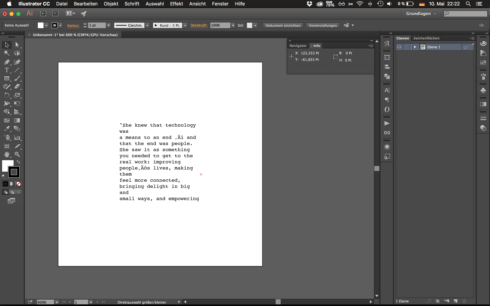

# Syntax

This basic example inserts a paragraph in an illustrator canvas with specific font properties. This example makes no use of polyfills and imports no other files. It just creates a bundle with es6 syntax tranformed to es3 syntax.

To compile run:
``
extendscriptr -s illustrator/syntax/syntax.js -o outputs/illustrator/syntax.js -t 'illustrator'
``

To run, open the file in ``outputs/illustrator/syntax.js`` in Extendscript Toolkit and run it or open it from illustrator by choosing it via the script prompt (``file > scripts > other script``)

You should see the following result:

